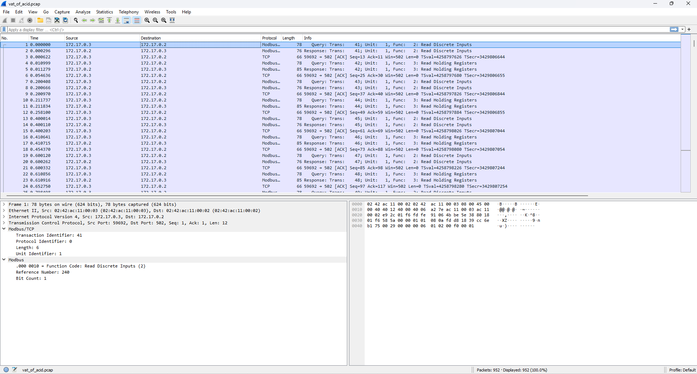
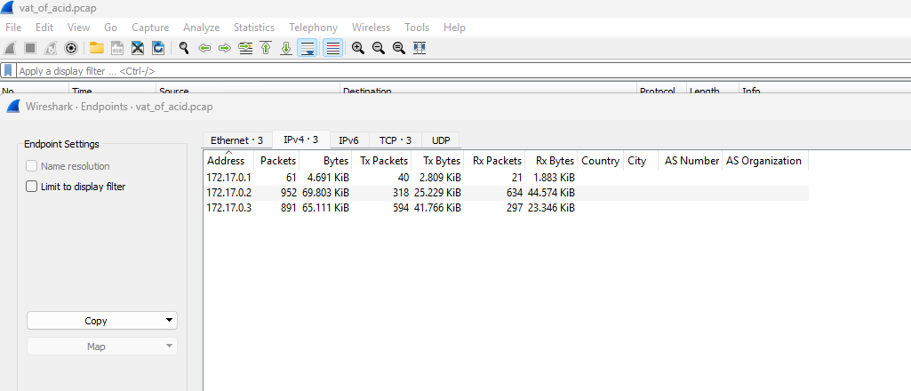
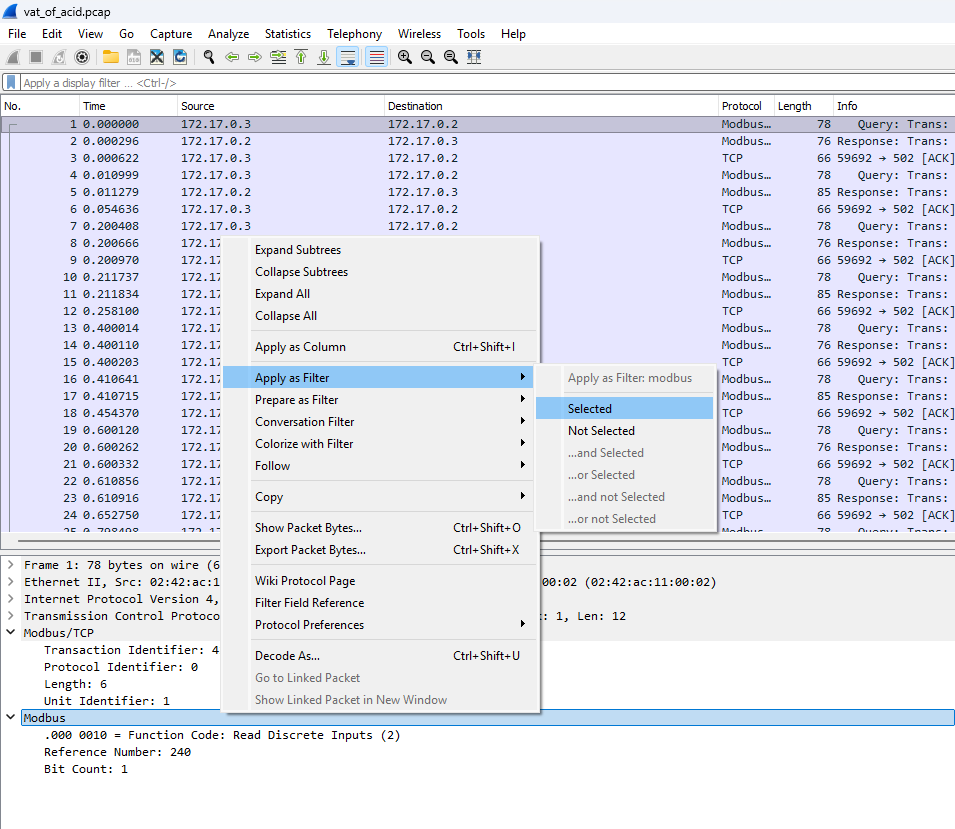
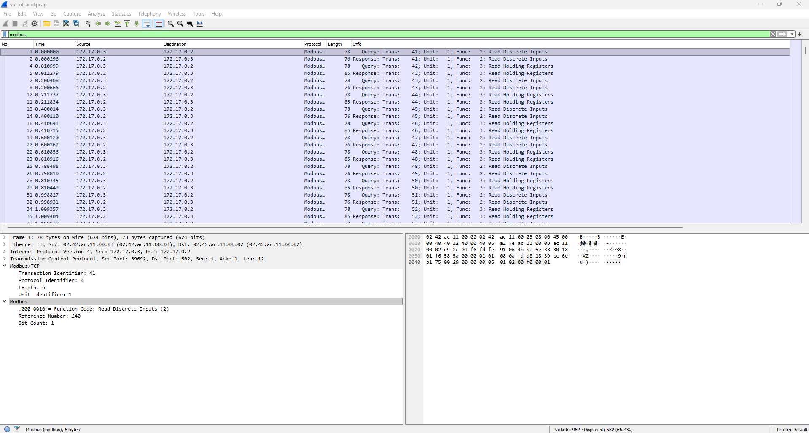
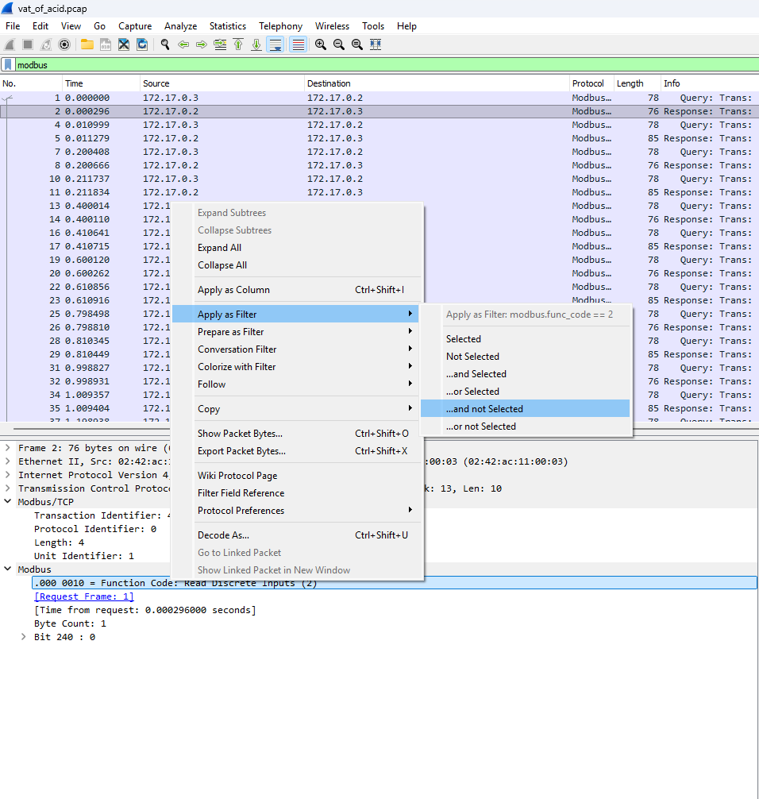
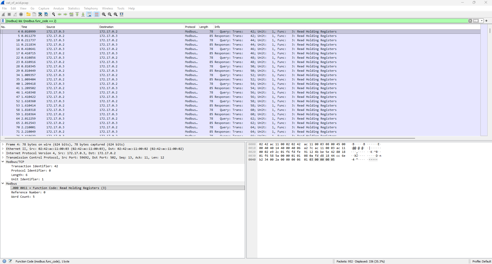
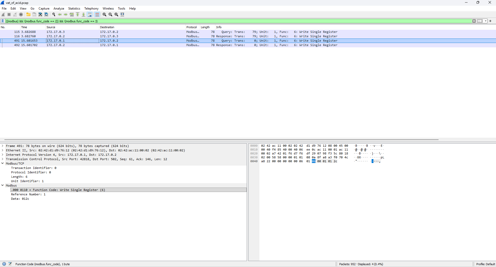
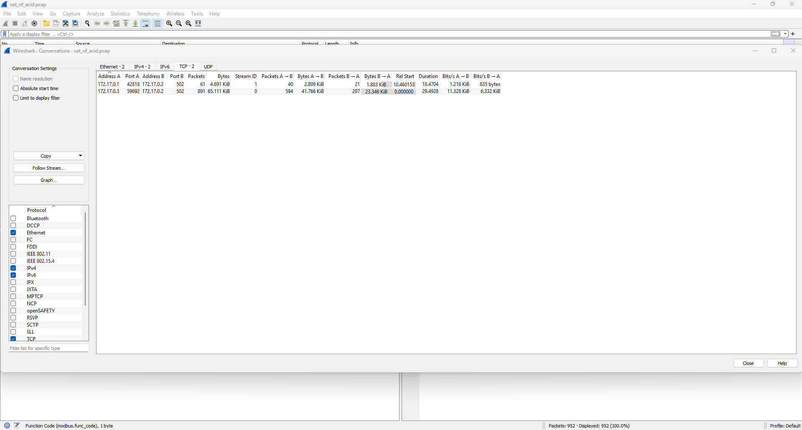

# Overview

> ## Vat of Acid 1
> **Description**\
> Like any good hacker con, TRISS keeps a vat of muriatic acid boiling at all times, for reasons which are obvious. However, just before the conference began, someone manipulated the vat temperature controller, taking it from the recommended 437 degrees Fahrenheit to a deadly 842 degrees Fahrenheit!!! Fortunately, like any good hacker con, TRISS also keeps a world-class ICS/OT SOC working at all times, and they've been able to identify a traffic capture containing the malicious manipulation. Since the PLC and HMI are truly airgapped, the attacker must have been physically present in the room with the vat when the attack occurred. By cross-referencing physical access logs with the precise timestamp of the attack, we should be able to find our attacker!
>
> Examine the attached file 'vat_of_acid.pcap', which started capturing at 2025-10-28 0600 EDT. At what time did the attack occur? 
>
> The flag format is "BarSides{GMT_DATETIME_IN_ISO_8601}". For instance, if the attack occured 5s after the capture began, the flag should be "BarSides{2025-10-28 10:00:05.000}". Round to the nearest millisecond.
>
> **Assets**\
> vat_of_acid.pcap

# Walkthrough

Load the PCAP in Wireshark. It's full of Modbus traffic. 

Click 'Endpoints'. Note that there are 3 IP addresses present in the PCAP. Take note of each. 

Return to the main view. Add a filter to only display Modbus traffic. You can do this by selecting a packet, right clicking 'Modbus' in the protocol stack, selecting 'Apply as Filter', and clicking 'Selected'. This is shown below.

Of course, if you already know the exact filter you want to use, you can simply type it in the 'Display Filter' box at the top and press 'Enter'. Regardless of which method you use, your screen should now resemble the following.

Add an additional filter that will exclude packets with Modbus function code '2: Read Discrete Inputs'. 

Add an additional filter that will exclude packets with Modbus function code '3: Read Holding Registers'. You are now left with 2 query-response pairs, one from .3 to .2 setting Unit Identifier 1 to 00aa (170 decimal) and one from .1 to .2 setting the same value to 012c (300). The former occured at timestamp 3.682, and the latter at 15.602.

Clear the display filters, then select Statistics, Conversations. Select the TCP tab. You should see two conversations, both with 172.17.0.2:502 as the server. 172.17.0.1 has sent 61 packets totaling 835 bytes, while 172.17.0.3 has sent 891 packets totalling 6.33 KiB. 

From this, we can make some educated guesses about the identies of each of the IPs. The 172.17.0.2 node serves Modbus over TCP 502, so it is acting as a Modbus Server or Modbus 'slave', a role which almost always goes to a Programmable Logic Controller (PLC). Meanwhile, the 172.17.0.3 node has the vast majority of the communications with the PLC, which is normal for a Human Machine Interface (HMI) that polls the status of the PLC multiple times a second. This leaves 172.17.0.1 as our attacker IP, which is consistent with the fact that the value it attempted to set, 300, is much higher than the 170 previously set by .3 or the 150 which the value had at the start of the capture. 

Thus, the attack occurred at 15.602s after start of capture, when 172.17.0.1 wrote the value 300 to a register with Unit Identifier 1. Based on the information in the challenge description, the flag is "BarSides{2025-10-28 10:00:15.602}".
