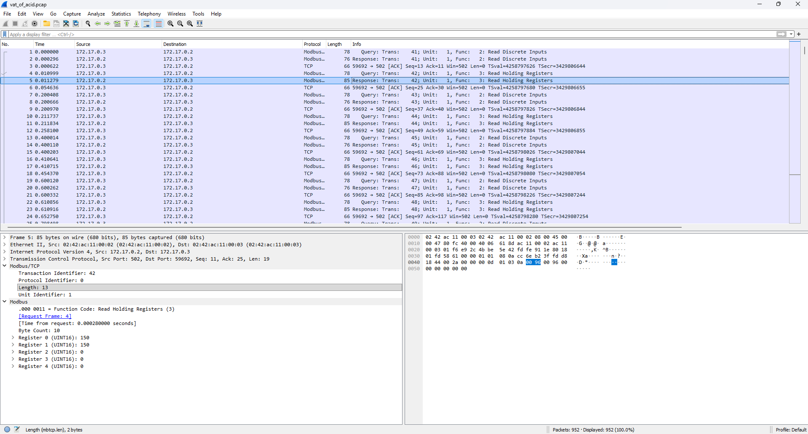
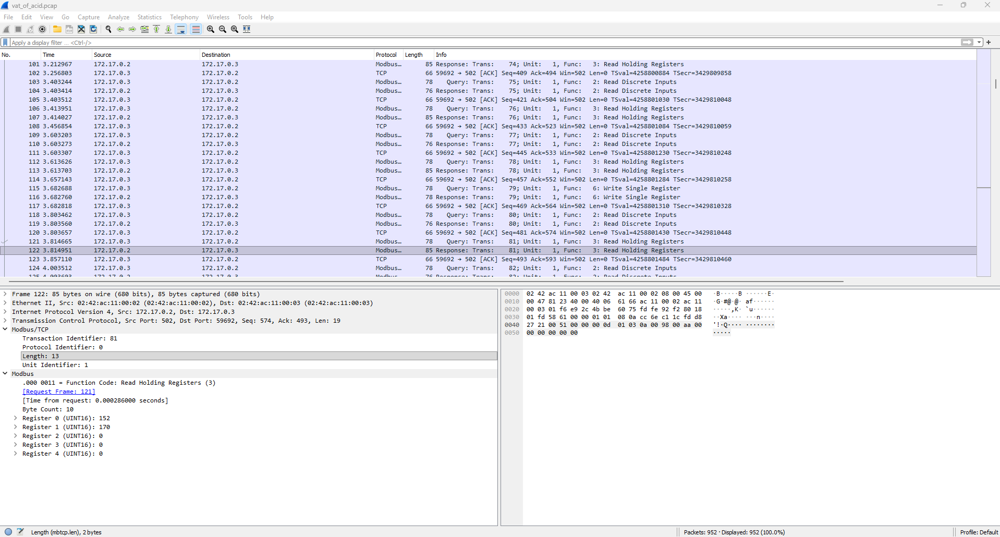
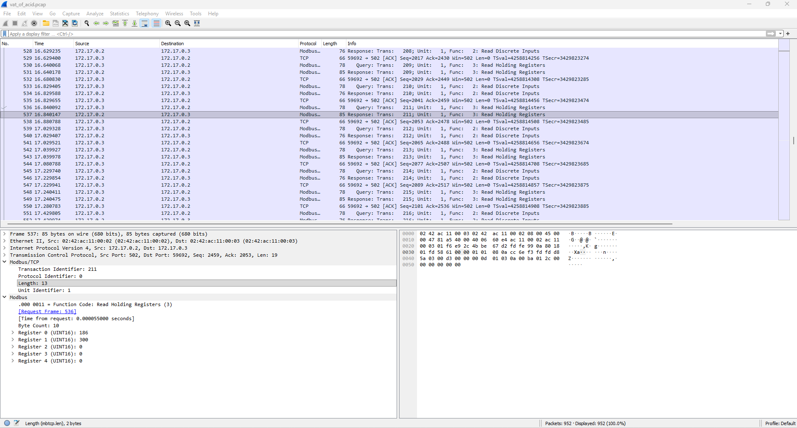

# Overview

> ## Vat of Acid 1
> **Description**\
> Oops! It turns out that TRISS doesn't want to restore the boiling vat of acid to the manufacturer-recommended 437 degrees Fahrenheit. TRISS has been in the boiling acid game for a *long* time, and they've got a secret temperature guaranteed to maximize the rate of reaction and create a perfect product every time, just like Grandma used to make. The secret temperature is so secret, in fact, that no one at TRISS knows what it is! Grandma TRISS comes and sets it before the conference every year, and physical access records show that this year she did so just before the PLC was hacked. 
> 
> We can't admit to Grandma TRISS that we were hacked, or that the secret temperature wasn't stored in an enterprise secrets vault for use in our incident response/disaster recovery plans - she'll be so disappointed in us!! Can you recover Grandma's secret boiling acid temperature from the PCAP?
>
> The flag has format "BarSides{TEMPERATURE_IN_FAHRENHEIT}". For instance, if the temperature is 500 degrees F, the flag is simply "BarSides{500}".
>
> **Assets**\
> vat_of_acid.pcap

# Walkthrough
In the walkthrough for 'Vat of Acid 1', we identified two 'Function Code 6: Write Single Register' queries. The first was sent by the HMI at 3.683s to set Unit Register 1 to 170, while the second was sent by the attacker at 15.602s to set that same register to 300. Prior to these writes, the value of the register was 150, as shown in the output of the 'Read Holding Registers' queries which we surpressed during the walkthrough for 'Vat of Acid 1'. In each of the following screenshots, examine the values of Registers 0 and 1.
 

Register 1 is updated following a successful 'Write Single Register' query, and Register 0 then adjusts to that value over a period of time. We can thus make an educated guess that Register 1 represents the *setpoint temperature*, while Register 0 represents the measured temperature. We may also reasonably assume that the setpoint temperature is related to the value of Register 1 by a linear constant: that is, for a given register value X which corresponds to temperature Y, c=X/Y is constant for all values X and associated Y. If that is the case, then:

> 437/150 = 2.913
> 842/300 = 2.807

Hm...not quite. But wait...shouldn't scientific temperatures be taken in Celsius, not Fahrenheit? Adjusting and trying again:

> 437F/150 = 225C/150 = 1.5
> 842F/300 = 450C/300 = 1.5

There we go! Thus:

> 170*1.5 = 255C = 491F.

The flag is "BarSides{491}".
